# Game Of Life

このリポジトリは[Godot](https://godotengine.org/)で[ライフゲーム](https://ja.wikipedia.org/wiki/%E3%83%A9%E3%82%A4%E3%83%95%E3%82%B2%E3%83%BC%E3%83%A0)を作成するサンプルです。

## はじめに

Godotは非常に理解し易いゲームエンジンです。

エンジンは完全に無料で、オープンソースで開発されています。

今回はライフゲームを通してGodotを理解していこうと思います。


- [Godot](https://godotengine.org/)
- [ライフゲーム - Wikipedia](https://ja.wikipedia.org/wiki/%E3%83%A9%E3%82%A4%E3%83%95%E3%82%B2%E3%83%BC%E3%83%A0)

> **Warning**
> この記事は初学者を対象として書かれています。
> そのため、ライフゲームのパフォーマンスなどは求めません。

## 環境

### PC

- Macbook Air Retina, 13-inch, 2020
- 1.2 GHz クアッドコアIntel Core i7
- Intel Iris Plus Graphics 1536 MB
- 16 GB 3733 MHz LPDDR4X

### Godot

- v4.1.stable.official [970459615]

## 環境構築を構築する

### ゲームエンジンをインストールする

まずは、この素晴らしいゲームエンジンをインストールしましょう。

[https://godotengine.org/download/macos/](https://godotengine.org/download/macos/)

*Pathを通したり、他のライブラリをインストールする必要はありません！素晴らしいですね。*

### プロジェクトをセットアップする

インストールしたエンジンを起動すると、プロジェクト一覧が表示されます。

新規プロジェクトをクリックし、このチュートリアル用のプロジェクトを作成してください。


> info
> このゲームエンジンは日本語対応しています。
> 右上の地球儀マークで日本語を選択するだけです。素晴らしいですね。​

### 画面サイズを調整する

今回のゲームでは、1つのセルのサイズを`32`に設定し、`30×30`のタイル上で実装します。

「プロジェクト」 -> 「プロジェクト設定」 -> 「表示」 -> 「ウィンドウ」の順にクリックして 「ビューポートの幅」 と「ビューポートの高さ」を`960`にセットします。

また、同じセクションの最下部にある「ストレッチ」オプションのところで、「モード」を`viewport`にします。

これによって、異なるサイズのスクリーンでも、同じようにゲームが拡大縮小されて表示されます。


## CellTileMapノードを作成する

Godotでタイルを表現するには[TileMap](https://docs.godotengine.org/en/stable/classes/class_tilemap.html)が適しています。

左上の「シーン」パネルから「その他のノード」をクリックし、Node一覧から「TileMap」をクリックします。

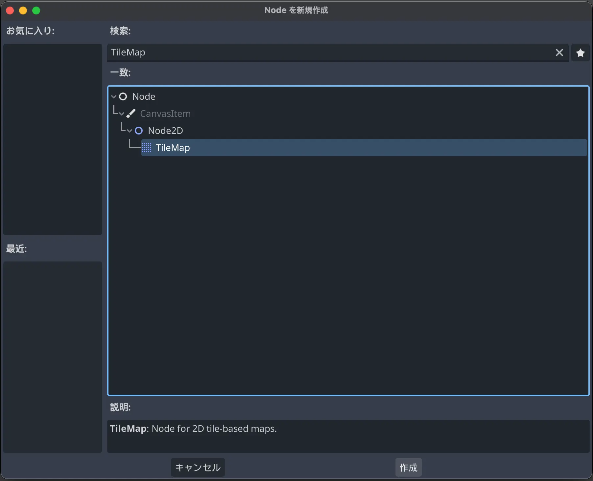

> info
> Godotでは、[Node](https://docs.godotengine.org/en/stable/classes/class_node.html)と呼ばれるパーツを組み合わせて機能を作成します。

今回は作成したTileMapには`CellTileMap`と名前をつけます。

> info
> GDScriptには[スタイルガイド](https://docs.godotengine.org/en/stable/tutorials/scripting/gdscript/gdscript_styleguide.html)が存在します。
> このプロジェクトでは、スタイルガイドに従って命名していきます。

出来上がったシーンを保存します。

「シーン」 -> 「シーンを保存」をクリックします。

Windows/Linuxでは`Ctrl+S`、macOSでは`Cmd+S`でも保存できます。

今回は`cell_tile_map.tscn`というファイル名で保存します。

### プロパティを編集する

右上の「インスペクター」パネルから「TileMap」の中にある「Tile Set」を選択し、「新規 Tile Set」をクリックします。

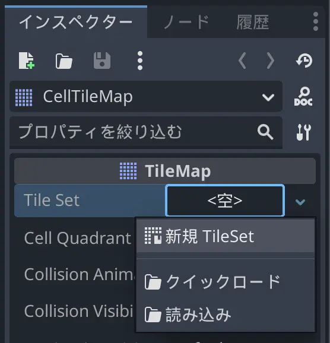

もう一度「Tile Set」をクリックすると、下側に「タイルセット」が開きます。

今回はセルの表示にGodotのアイコンを利用します。

左下にある「ファイルシステム」パネルから`res://icon.svg`を選択し、「タイル」パネルにドラッグアンドドロップします。

途中、「アトラスのテクスチャが変更されました。アトラスにタイルを自動的に作成しますか？」と聞かれますが、「はい」でも「いいえ」でもどちらでも構いません。

「セットアップ」タブから「texture_region_size」を選択し、ｘ, yそれぞれの値を`res://icon.svg`のサイズである'128'に設定します。

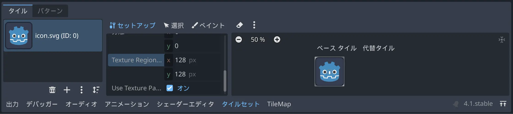

タイルサイズに合わせて左上の「インスペクター」パネルから「TileMap」の中にある「Tile Size」を選択し、先程設定した「texture_region_size」と同じ`128`をx, yそれぞれに設定します。

最後に、左上の「インスペクター」パネルから「Node2D」の中にある「Transform」 -> 「Scale」を選択し、今回のセルサイズに合わせるために x, yそれぞれ`0.25`に設定します。

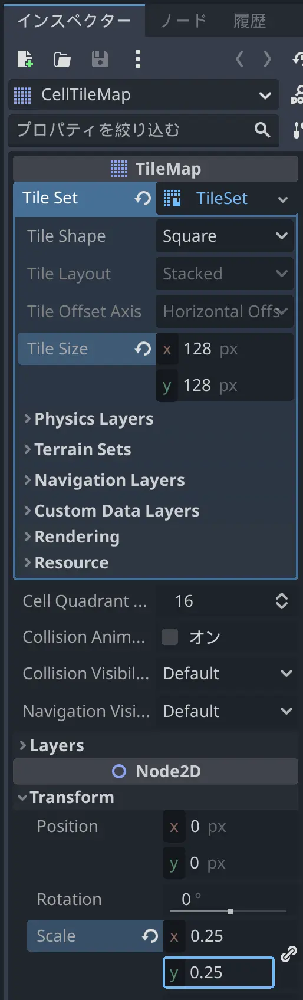

## スクリプトを設定する

左上の「シーン」パネルから「CellTileMap」ノードを選択し、その状態でスクリプトのアタッチを行います。（「シーン」パネル右上のアイコン）

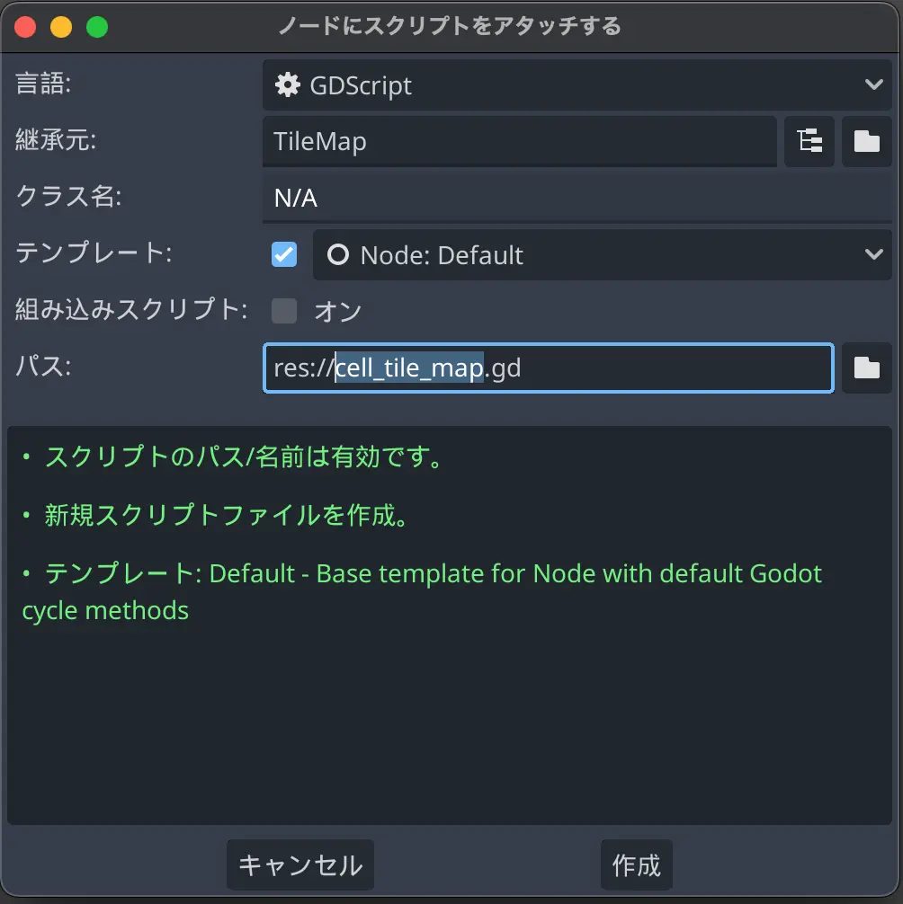

スクリプトを以下に書き換えます。

`cell_tile_map.gd`

```gdscript
extends TileMap

# セルサイズ
var cell_size := Vector2(tile_set.tile_size) * transform.get_scale()

# 表示サイズ
@onready var viewport_size := get_viewport_rect().size
# タイルマップ
@onready var tile_map: Vector2i = (viewport_size / cell_size).ceil()


# セルリストを初期化します
# incidenceは生成割合です
func reset(incidence := 0.5) -> void:
	# 各セルをランダムで生成します
	for x in tile_map.x:
		for y in tile_map.y:
			# 乱数が生成割合以下の場合は生成しません
			if (randf() < incidence): continue

			_add_cell(Vector2i(x, y))


# セルを生成します
func _add_cell(coords: Vector2i) -> void:
	set_cell(0, coords, 0, Vector2i(0, 0))

```

今回は確認したいので以下のコードも追加します。

`cell_tile_map.gd`

```gdscript
# セットアップ処理です
func _ready() -> void:
	# セルリストを初期化します
	reset()

```

試しに実行してみましょう。

左上の現在のシーンを実行（再生アイコンが描かれたカチンコアイコン）を押します。

Windows/Linuxでは`Ctrl+R`、macOSでは`Cmd+R`を押してもシーンを実行できます。

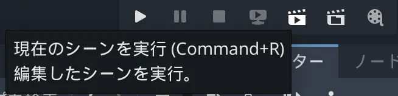

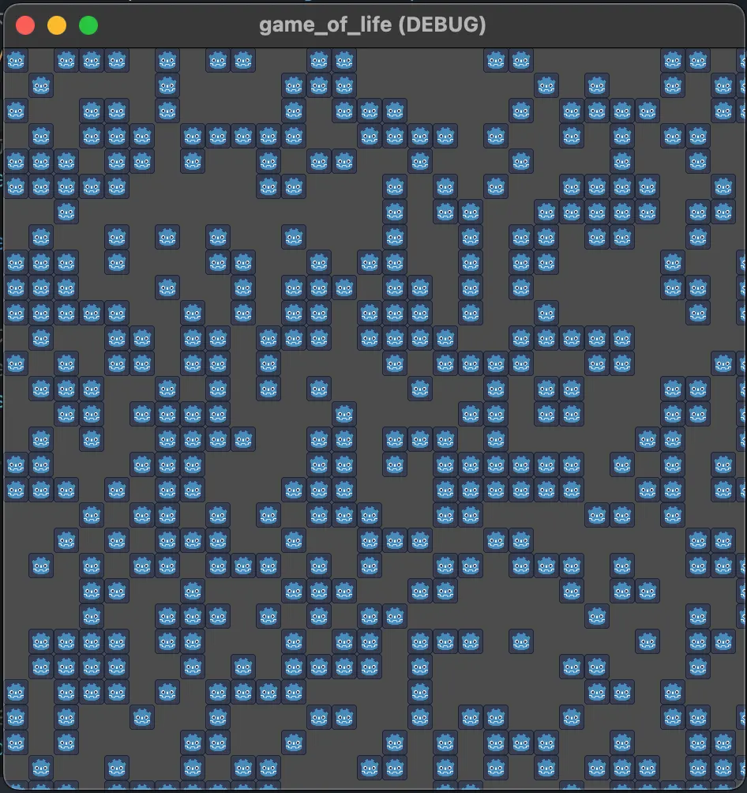

> info
> シーンはゲームの他の部分を作成する前であってもシーン単体でテストすることが可能です。
> 素晴らしいですね。

## Mainノードを作成する

はじめに実行されるノードとしてMainノードを作成します。

左下の「ファイルシステム」パネルを右クリックして新規シーンを作成します。

メインパネルの新規シーンの追加アイコン（＋マーク）をクリックするか、Windows/LinuxではCtrl+N、macOSではCmd+Nを入力しても作成できます。

ルートノードとして[Node](https://docs.godotengine.org/en/stable/classes/class_node.html)を選択し、名前をMainに変更します。

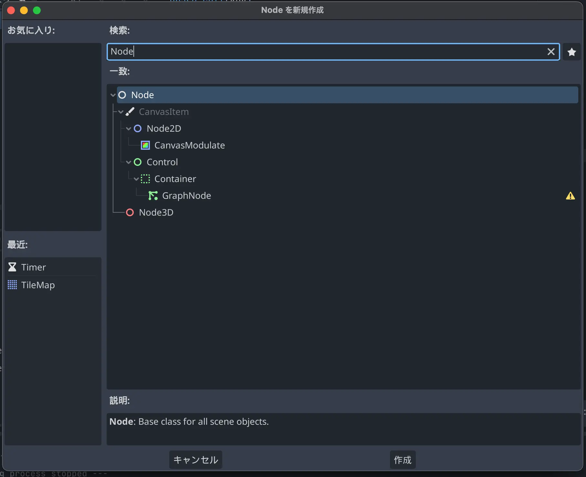

今回は`main.tscn`というファイル名で保存します。

このMainノードに、CellTileMapシーンを追加します。

左上の「シーン」パネルから子シーンを追加するボタン（鎖アイコン）をクリックします。

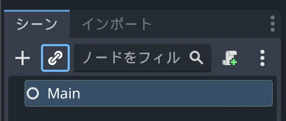

`cell_tile_map.tscn`を選択します。

### スクリプトを追加する

Mainノードにスクリプトのアタッチします。

今回のスクリプト名は`main.gd`とします。

スクリプトを以下に書き換えます。

`main.gd`

```gdscript
extends Node


# セットアップ処理です
func _ready() -> void:
	# セルリストを初期化します
	$CellTileMap.reset()

```

> info
> Godotでは子要素に$\[ノード名\]で簡単にアクセスすることができます。
> 素晴らしいですね。

これで、CellTileMap側で初期化する必要はなくなったので、以下のコードは削除して置きましょう。

`cell_tile_map.gd`

```diff
- # セットアップ処理です
- func _ready() -> void:
- 	# セルリストを初期化します
- 	$CellTileMap.reset()
```

### メインシーンを設定する

Windows/LinuxではCtrl+B、macOSではCmd+Bを入力し、ゲーム全体を実行します。

実行の最にメインシーンの選択ダイアログが表示されますので、`main.tscn`を選択します。

> info
> 「プロジェクト」 -> 「プロジェクト設定」 -> 「アプリケーション」リスト内の「実行」の中でメインシーンは定義されています。

## セルを更新する

いよいよメインとなるセルの更新処理を記述していきます。

`cell_tile_map.gd`に以下の関数を追加します

`cell_tile_map.gd`

```gdscript
# 各セルを更新します
func update() -> void:
	# 現在のセルの状態を取得します
	var cells = _get_cells_state()

	# セルの状態を更新します
	for key in cells:
		# 周りのセルが何個生きているカウントします
		var lives = 0

		# 周囲のセルを調べます
		for dy in range(-1, 2):
			for dx in range(-1, 2):
				if dy == 0 && dx == 0: continue

				# 画面恥は繋がっているものとして座標を更新します
				var x := int(key.x + dx + tile_map.x) % int(tile_map.x)
				var y := int(key.y + dy + tile_map.y) % int(tile_map.y)
				var target_map := Vector2i(x, y)

				if cells[target_map]:
					lives += 1

		# セルを更新します
		if !cells[key] && lives == 3:
			_add_cell(key)
		elif cells[key] && (lives <= 1 || lives >= 4):
			_erase_cell(key)


# セルを削除します
func _erase_cell(coords: Vector2i) -> void:
	erase_cell(0, coords)


# 各セル座標上にセルが存在するかどうかの状態を取得します
func _get_cells_state() -> Dictionary:
	var dict := {}

	# セル座標をkey, セルの存在をvalueとして登録します
	for x in tile_map.x:
		for y in tile_map.y:
			var coords := Vector2i(x, y)
			dict[coords] = get_cell_alternative_tile(0, coords) >= 0

	return dict

```

次にMainノードに[Timerノード](https://docs.godotengine.org/en/stable/classes/class_timer.html)を追加します。

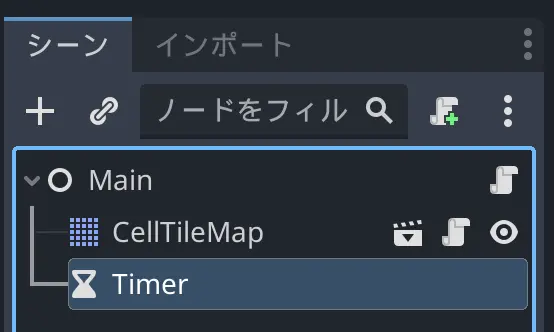

右上の「インスペクター」パネルから「Timer」リストの中にある「Wait Time」を`0.1`に設定し、「Autostart」を`オン`にします。

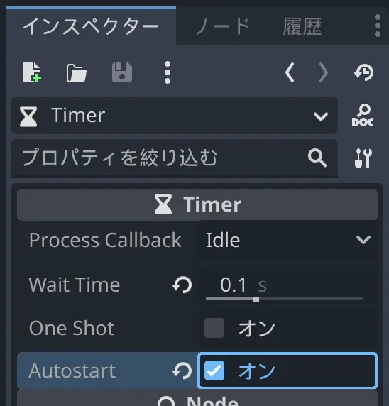

これで、自動的に開始される0.1秒カウントのループタイマーが作成できました。

このタイマーに先程作成した更新処理を紐づけます。

右上の「インスペクター」パネルの隣にある「ノード」タブをクリックし、「ノード」パネルを開きます。

「Timer」リストの中にある「timeout()」シグナルをダブルクリックします。

シグナルを接続する設定画面が開きますので、Mainノードが選択されているのを確認して「接続」をクリックします。

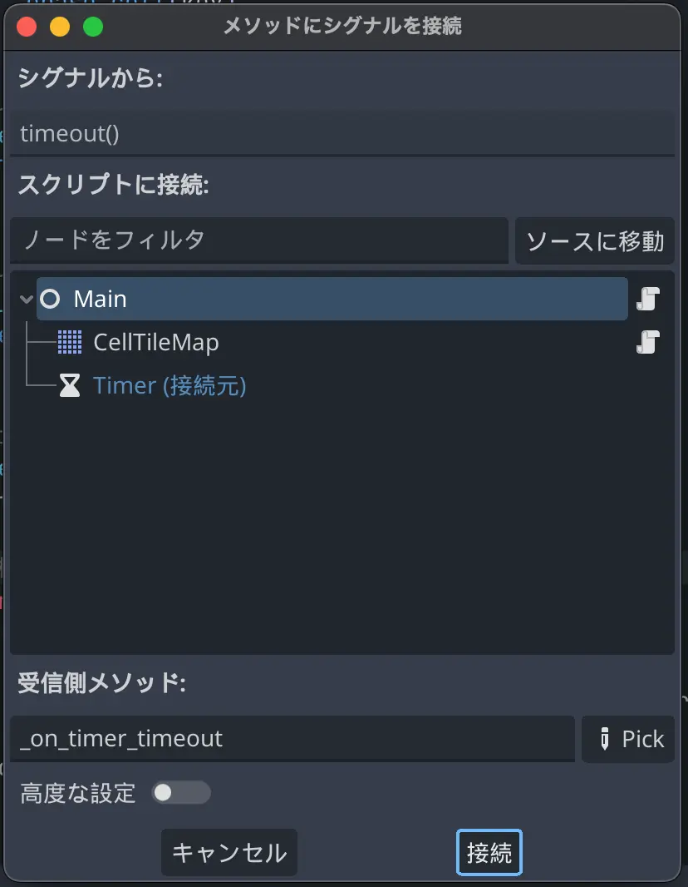

作成されたシグナル内で更新処理を呼び出します。

`main.gd`

```gdscript
func _on_timer_timeout() -> void:
	# セルを更新します
	$CellTileMap.update()
```

これで、ゲームの完成です。

お疲れ様でした。

実行してみると、ライフゲームがはじまります。


