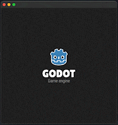
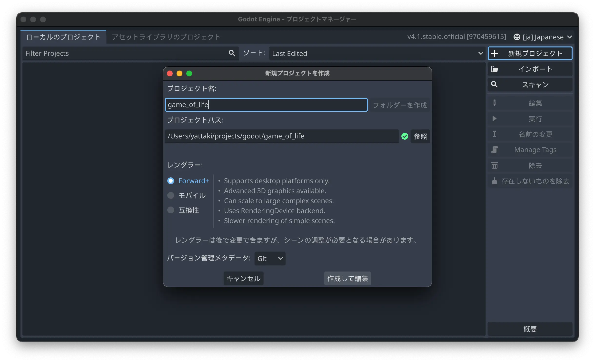
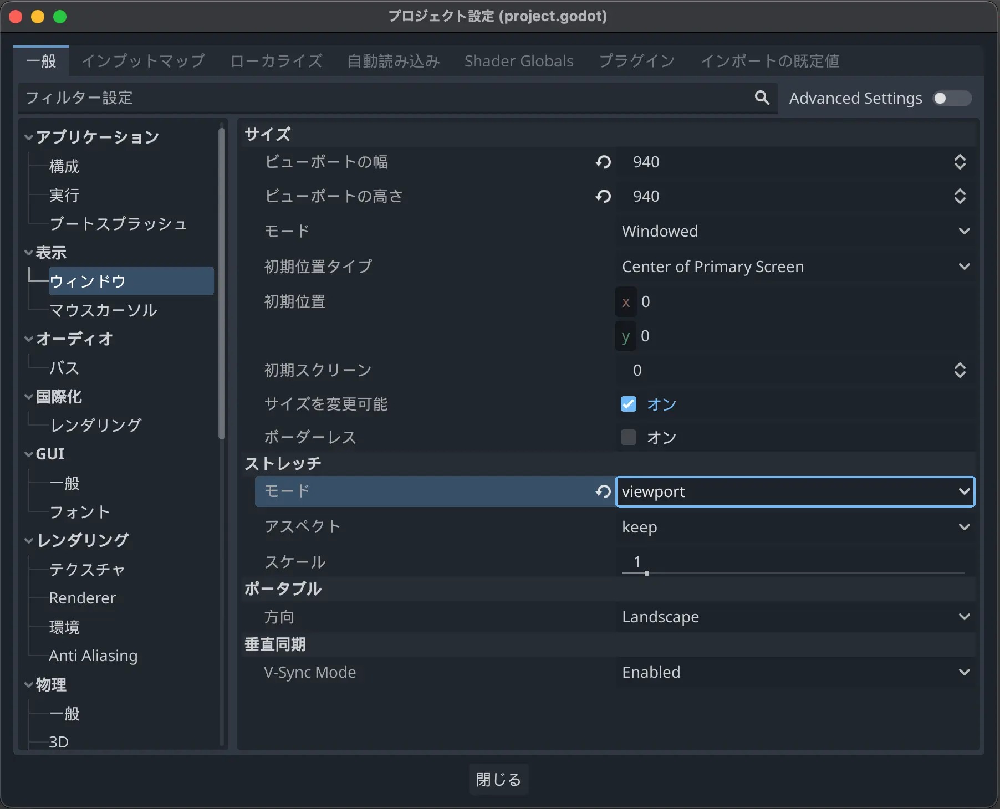

# Game Of Life

このリポジトリは[Godot](https://godotengine.org/)で[ライフゲーム](https://ja.wikipedia.org/wiki/%E3%83%A9%E3%82%A4%E3%83%95%E3%82%B2%E3%83%BC%E3%83%A0)を作成するサンプルです。

## はじめに

Godotは非常に理解し易いゲームエンジンです。

エンジンは完全に無料で、オープンソースで開発されています。

今回はライフゲームを通してGodotを理解していこうと思います。

- [Godot](https://godotengine.org/)
- [ライフゲーム - Wikipedia](https://ja.wikipedia.org/wiki/%E3%83%A9%E3%82%A4%E3%83%95%E3%82%B2%E3%83%BC%E3%83%A0)

> **Warning**
> この記事は初学者を対象として書かれています。
> そのため、ライフゲームのパフォーマンスなどは求めません。

## 環境

### PC

    Macbook Air Retina, 13-inch, 2020
    1.2 GHz クアッドコアIntel Core i7
    Intel Iris Plus Graphics 1536 MB
    16 GB 3733 MHz LPDDR4X

### Godot

    v4.1.stable.official [970459615]

## 環境構築を構築する

### ゲームエンジンをインストールする

まずは、この素晴らしいゲームエンジンをインストールしましょう。

[https://godotengine.org/download/macos/](https://godotengine.org/download/macos/)

*Pathを通したり、他のライブラリをインストールする必要はありません！素晴らしいですね。*

### プロジェクトをセットアップする

インストールしたエンジンを起動すると、プロジェクト一覧が表示されます。

新規プロジェクトをクリックし、このチュートリアル用のプロジェクトを作成してください。

> info
> このゲームエンジンは日本語対応しています。
> 右上の地球儀マークで日本語を選択するだけです。素晴らしいですね。​

### 画面サイズを調整する

今回のゲームでは、1つのセルのサイズを`32`に設定し、`30×30`のタイル上で実装します。

プロジェクト -> プロジェクト設定 -> 表示 -> ウィンドウの順にクリックして 「ビューポートの幅」 と「ビューポートの高さ」を`960`にセットします。

また、同じセクションの最下部にある「ストレッチ」オプションのところで、「モード」を`viewport`にします。

これによって、異なるサイズのスクリーンでも、同じようにゲームが拡大縮小されて表示されます。

